# 14/10/2025 - Redesign

The entire arm has been redesigned for a simpler layout and to allow easy mounting of ArUco markers. 

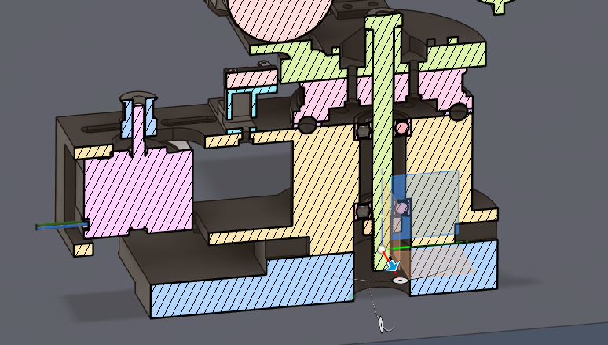

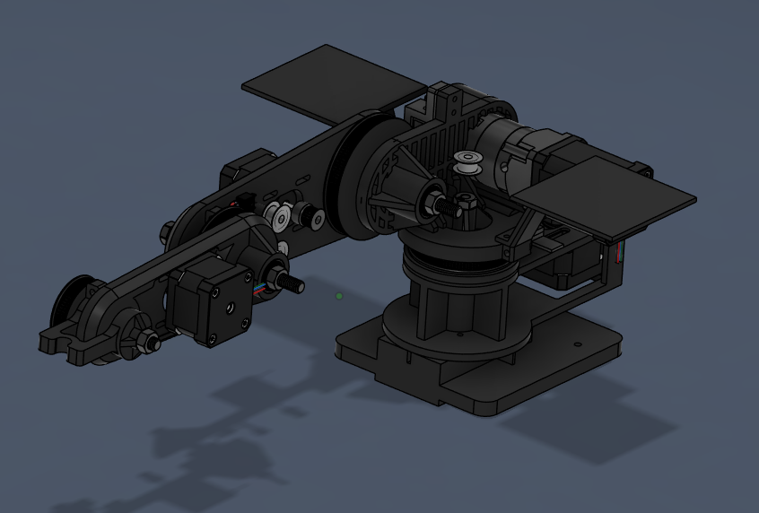

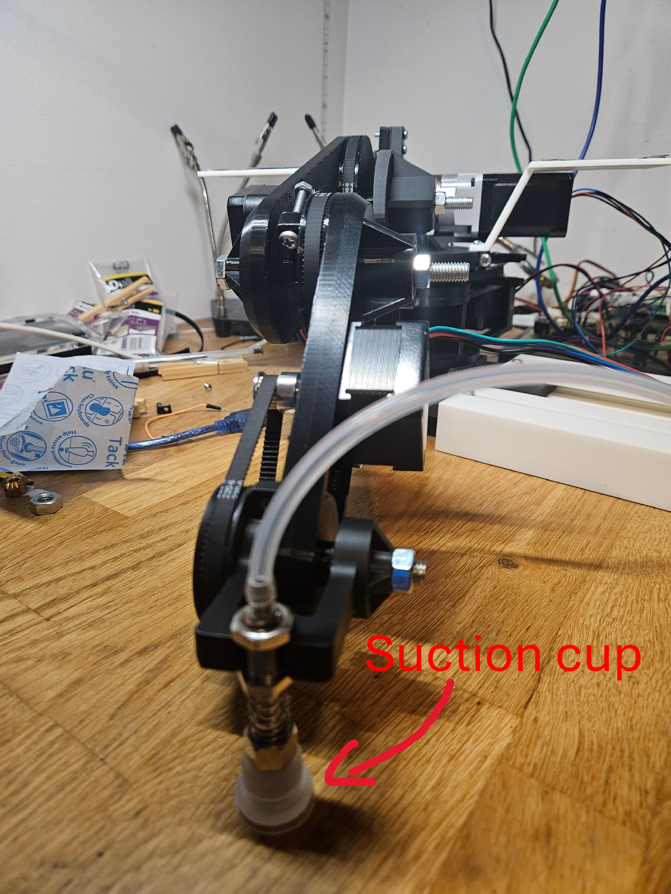

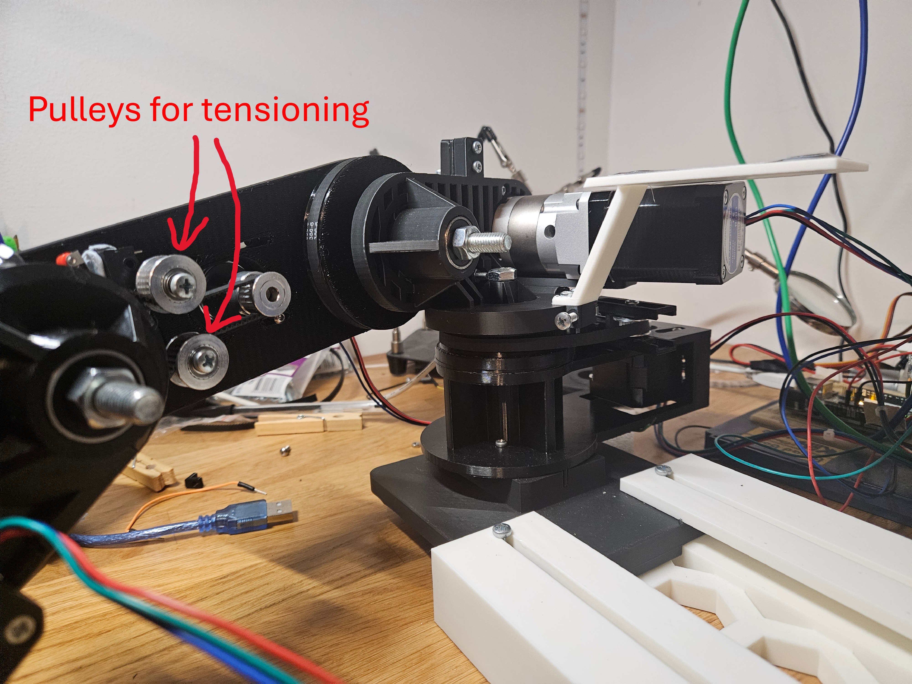

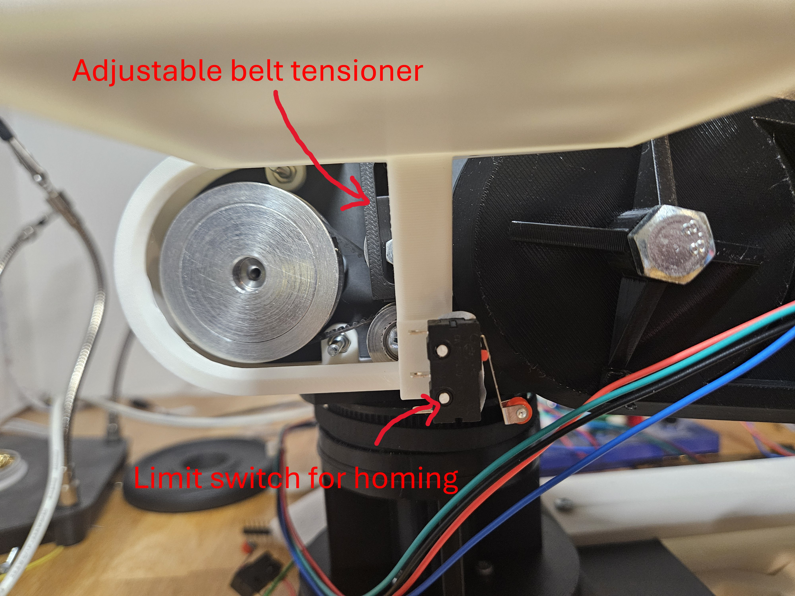

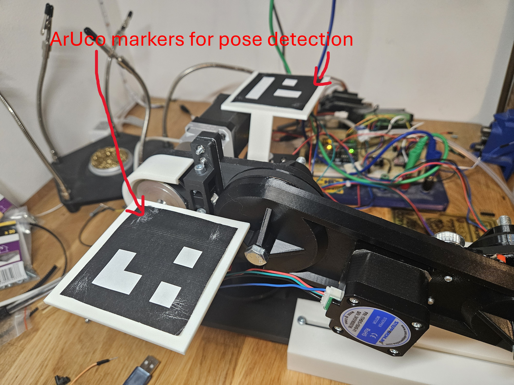

# 20/09/2025 - YOLO card detection

The card detection is complete. 

- The dataset contains 828 images of the four cards, with differing orientation, position, lighting and card count. There are also negative images to prevent false positives during deployment of the model. 
- The images were labelled using [Label Studio](https://labelstud.io/), shown below:
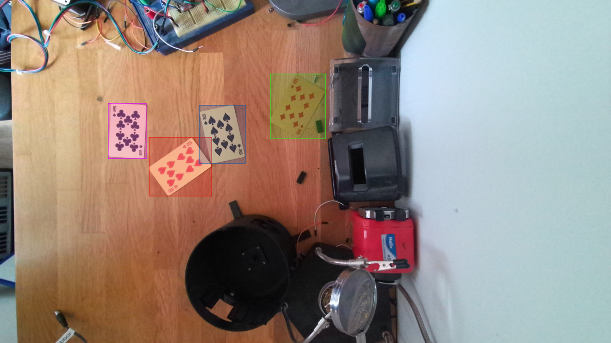

- The images were randomly split into 80% training and 20% validation. 
- I chose to use YOLO11n to optimise frame rate for use on a raspberry pi; a comparison of the different YOLO11 sub-models is shown below:
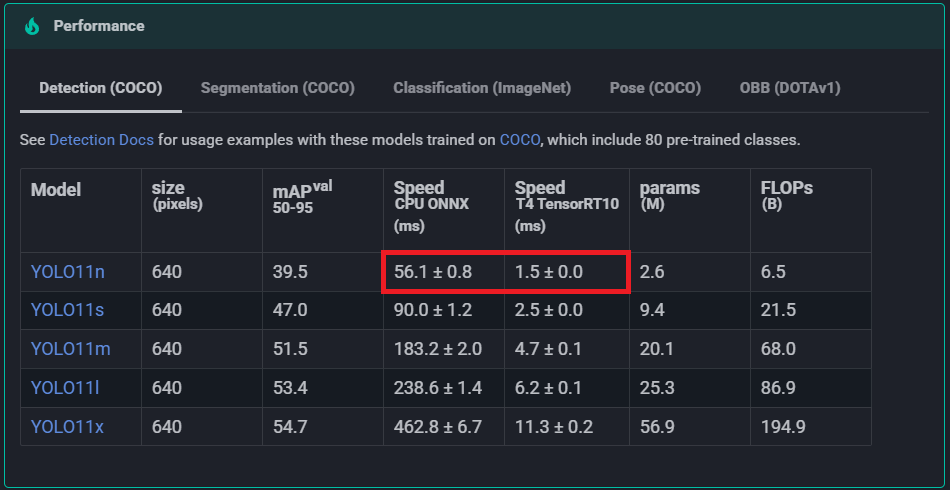

- I trained the model locally on an Nvidia RTX 3060Ti GPU, with 40 epochs, which is shown below:
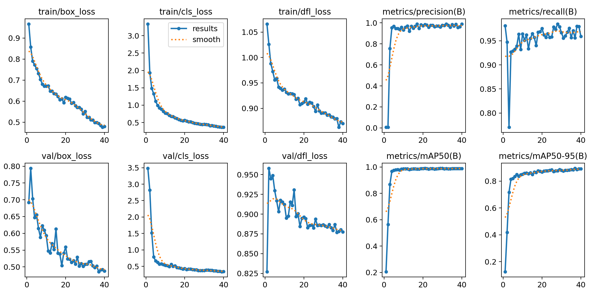

- I wrote a python program to detect the cards in real time, and also combined the Aruco marker detection; a demo is shown below:

https://github.com/user-attachments/assets/7dcee5a4-68bd-4ffd-b935-b0bce6134944

# 19/09/2025 - Suction pipeline

The suction pipeline contains:
- Arduino uno with a sensor shield
- Solenoid valve
- DC vacuum pump
- Suction cup
- Silicone tubing

The pump and valve are controlled using the Servo arduino library. The suction cup will be used as the end effector for the robotic arm, to pick up the playing cards.

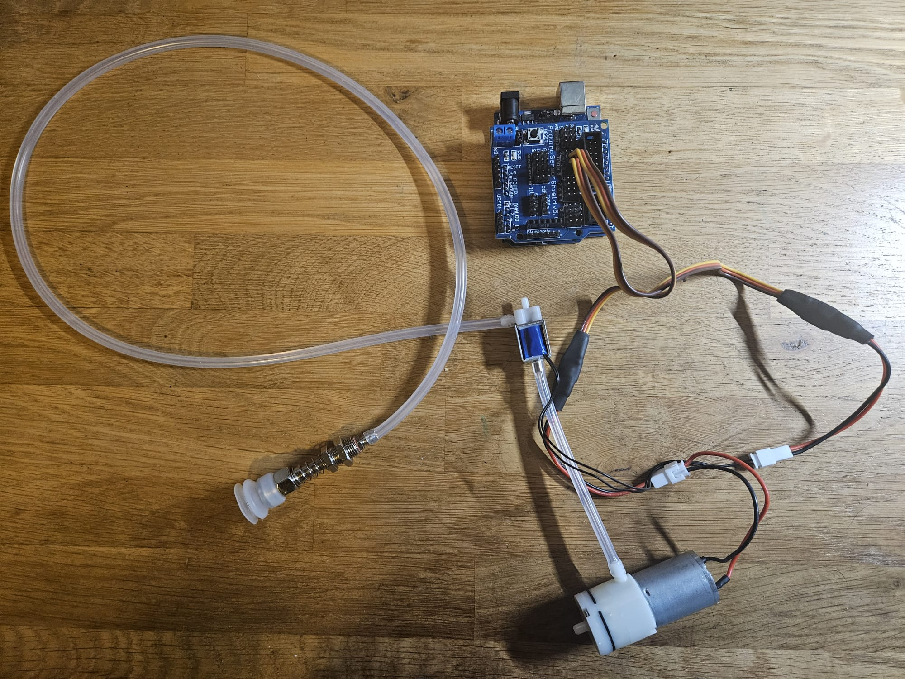

# 26/08/2025 - Raspberry Pi & Arduino Communication

I set up communication between the raspberry pi & arduino, using a serial connection.
I also incorporated the inverse kinematics script, so that the joint angles are calculated on the pi, then sent to the arduino.

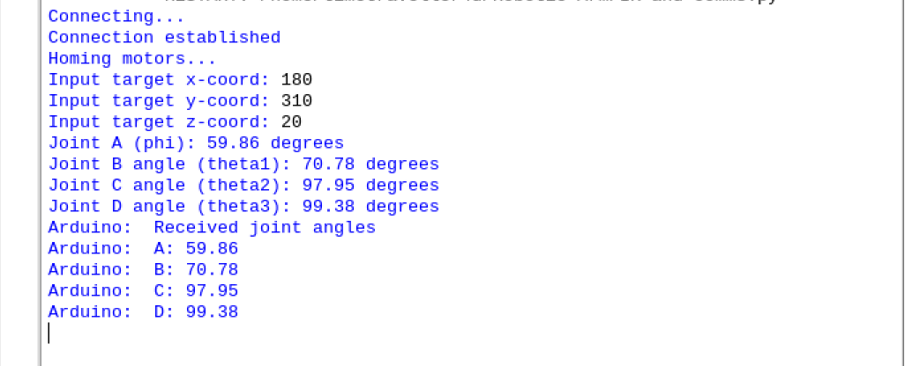

# 03/08/2025 - Image dataset

In order to train a YOLO model to detect playing cards (and which suit it is), I must gather many example images:
- The arm will sort playing cards by suit, so use the 10s because they have the most identifiable objects (e.g. hearts).
- Must be in the same conditions as the task will be carried out in to maximise performance, same lighting, same background, etc
- I aim to gather around 400 images, since the arm will be working in a controlled environment - the background will not change during detection
  
Then the next steps are:
- The images must be labelled, I'm using [Label Studio](https://labelstud.io/)
 to achieve this
- Images must be split into training and validation sets
- Then I will train the model using an anaconda virtual environment, using a local GPU

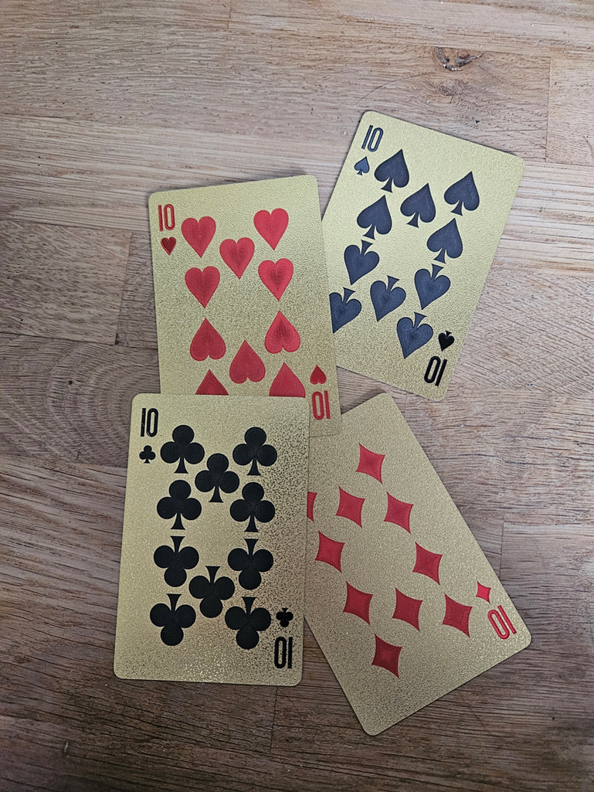

# 02/08/2025 - Base completion

The base has been completed apart from the lid. The motors are mounted outside the turret, as an improvement on the previous version of the arm. It allows any NEMA 17 motor to be mounted without changing the design, and also allows easier access to the cables.

It features:
- Rotating turret to accommodate a counterweight
- Centering mechanism
- Timing belt driven rotation
- Belt tensioner
- NEMA 17 motors
- Limit switch for motor homing

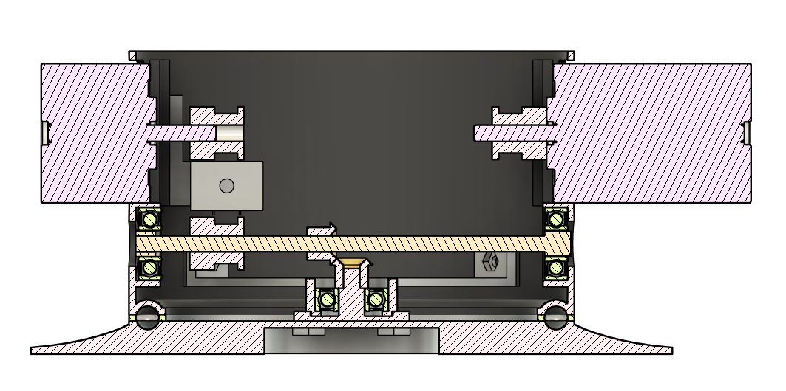

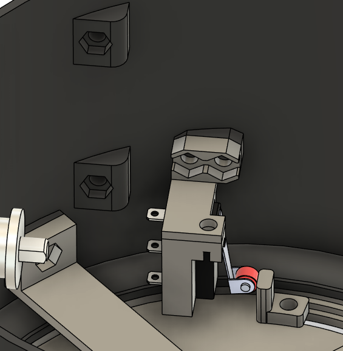

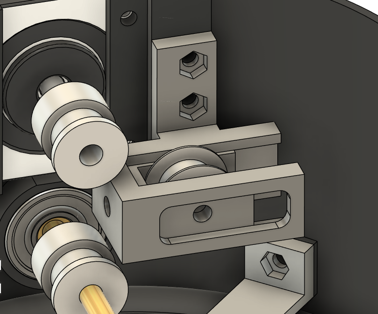
